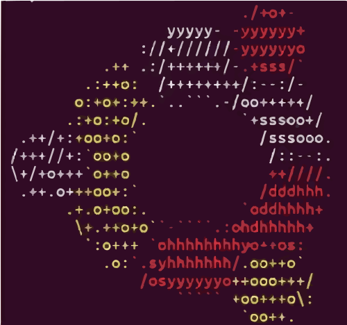

<p align="center">
</p>

## Table of Contents
  1. [Basic Commands](#1-basic-commands)

# 1. Basic Commands
## a. `echo`
Display the line of text
```bash
echo Hello World
```

```
Hello World
```
## b. `Vim`
Used to create a new file 
```bash
vim text.txt
```
It will immediately open the file. Consider the following :
<br>

####  <u>Entering the Insert mode</u>
`i`: Insert text at the current cursor position.<br>
`a`: Append text after the current cursor position.<br>
`I`: Insert text at the beginning of the current line.<br>
`A`: Append text at the end of the current line.<br>

#### <u>Exiting the Insert mode </u>
 Press `Esc` to return to normal mode

#### <u>Saving and quiting the file</u> (from normal mode)
`:w`: Save the file.<br>
`:q`: Quit Vim (if no unsaved changes).<br>
`:wq`: Save and quit.<br>
`:q!`: Quit without saving (discarding changes).<br>

## c. `cat`
Display the text of the file (.txt) in the temianal
```bash
cat text.txt
```

#### Note:- file extension (.sh) creates a bash script (shell) file.
To get the output of this bash file, use the following syntax:-
```bash
bash myscript.sh
```
Also, we can specify the interpreter in the file only by providing the full path of the <b>shell interpreter</b> at the begining of the file, like this:-
```
#!/bin/bash
```
ie- ``#! (location of the shell interpreter)``


To the full pateh of your shell interpreter, type this command in the terminal:-
```bash
echo $SHELL
```
Now we can run this file directly by just typing the filname after period(.) in the terminal
```t
./myscript.sh
```
If it shows permission denied, use the chmod command. (which is covered later)
## d. `ls`
Display all the files in current working directory
``` bash
ls
```
``` bash
text.txt   myscript.sh
```
### <u>d.1</u> ``ls -l``
``-l`` is a tag to ``ls`` command which shows all the files in  <b>long/expanded format</b> of the current working directory
```bash 
ls-l
```
```bash
total 12
drwxr-xr-x 2 raghav raghav 4096 Aug  9 00:09 Project
-rw-r--r-- 1 raghav raghav   30 Aug 18 17:58 myscript.sh
-rw-r--r-- 1 raghav raghav   50 Aug 13 18:54 text.txt
```

## e. `chmod`
This command is used to change the file system permissions (or access modes) of files and directories. It allows control over who can read, write, or execute a file or directory. 
### <u>Syntax</u>:
```bash
chmod [options] mode[,mode] file1 [file2 ...]
```

### <u>Permissions can be specified in two ways</u>:
### <u><i>Symbolic Mode</i></u>:
Uses letters and operators to add, remove, or set permissions.

<b>Who</b>: `u` (user/owner), `g` (group), `o` (others), `a` (all).

<b>Operator</b>: `+` (add permission), `-` (remove permission), `=` (set permission exactly).

<b>Permission</b>: `r` (read), `w` (write), `x` (execute)

<b>Example</b>: `chmod u+x myscript.sh` (adds execute permission for the owner).

### <u><i>Octal (Numeric) Mode</i></u>:
Uses a three-digit octal number, where each digit represents permissions for the owner, group, and others, respectively.

<b>Permissions values</b>: `4` (read), `2` (write), `1` (execute). These values are summed to represent the desired permissions.

<b>Example</b>: `chmod 755 myscript.sh` (owner has read, write, execute; group and others have read and execute).
<ul><li>7 (4+2+1) = read, write, execute for owner.</li>
<li>5 (4+1) = read, execute for group.</li>
<li>5 (4+1) = read, execute for others.</li></ul>

### <u>Common Options</u>:
`-R`: Recursively changes permissions for files and subdirectories within a directory.

`-v`: Provides verbose output, showing a diagnostic message for each file processed.

### <u>Examples</u>:
<b>Make a script executable</b>: `chmod +x my_script.sh`

<b>Grant read and write to owner, read-only to others</b>: `chmod 644 file.txt`

<b>Give full permissions to everyone recursively</b>: `chmod -R 777 my_directory/`